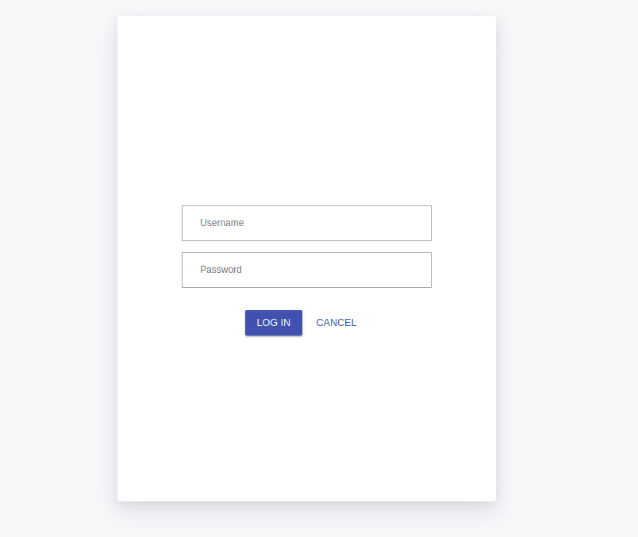
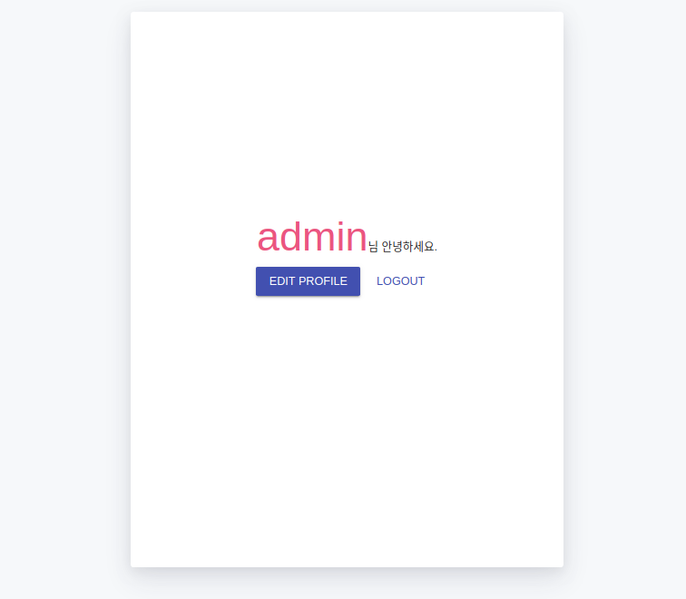

# django-login-example
django login page example


### Development Environment
- OS : Ubuntu
- Language : Python 3.6
- Framework : Django 2.2.2
- DB : Sqlite3
- Front-UI : Material.js


#### 1. Github 에서 소스 가져오기
sssunda's github : <http://github.com/sssunda/django-login-example>


```bash
$ git clone http://github.com/sssunda/django-login-example
```


#### 2. 서버 초기화 및 시작


```bash
# 초기화
bash ./django-login-example/bin/init_app.sh
# 시작
bash ./django-login-example/bin/run_app.sh
```

#### [참고]
##### init_app.sh 소스

```bash
# Move to parent directory
SCRIPT_DIR=$( cd "$( dirname "${BASH_SOURCE[0]}" )" && pwd )
cd $SCRIPT_DIR
cd ..

# 가상환경 생성 및 진입(서버 초기설정) 
virtualenv --python=python3.6 myvenv

# 장고 설치
pip install django~=2.0

# DB 초기화
python manage.py migrate

# 웹 서버 실행
python manage.py runserver
```

##### run_app.sh 소스(서버 구동)

```bash
# Move to parent directory
SCRIPT_DIR=$( cd "$( dirname "${BASH_SOURCE[0]}" )" && pwd )
cd $SCRIPT_DIR
cd ..

# 가상환경 진입
source myvenv/bin/activate

# DB 초기화
python manage.py migrate

# 웹 서버 실행
python manage.py runserver
```

명령을 실행한 후, <http://127.0.0.1:8000>에 접속하면 만들어진 웹사이트를 볼 수 있습니다.


##### 스크린샷
main
-----


login page
-----



login page (logined)
-----



edit page
-----


sign up page
-----
 
